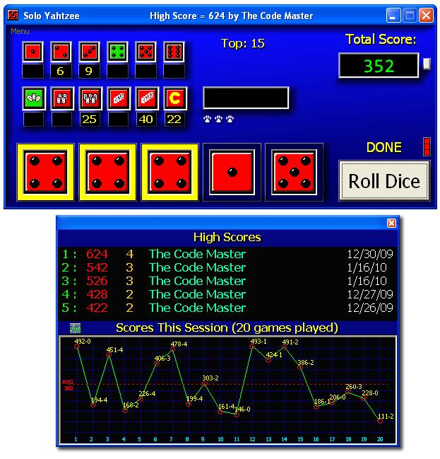

<div align="center">

## Solo Yahtzee


</div>

### Description

Updated Version 3.0.0.83: Solo Yahtzee is a single player graphically based Yahtzee game designed to be played on any Windows machine. It&#8217;s extremely easy to play and very addictive. The code is not commented (not much anyway) &#8211; my apologies.

This is the FINAL-FINAL updated version. Newly added features include: Sounds, Advanced High Score keeping, Intelligent auto-play assistant, and more. I've added an interesting session graphing function to monitor your game play. Enjoy!
 
### More Info
 


<span>             |<span>
---                |---
**Submitted On**   |2010-01-16 12:57:48
**By**             |[0x34](https://github.com/Planet-Source-Code/PSCIndex/blob/master/ByAuthor/0x34.md)
**Level**          |Intermediate
**User Rating**    |5.0 (30 globes from 6 users)
**Compatibility**  |VB 6\.0
**Category**       |[Games](https://github.com/Planet-Source-Code/PSCIndex/blob/master/ByCategory/games__1-38.md)
**World**          |[Visual Basic](https://github.com/Planet-Source-Code/PSCIndex/blob/master/ByWorld/visual-basic.md)
**Archive File**   |[Solo\_Yahtz2172971162010\.zip](https://github.com/Planet-Source-Code/0x34-solo-yahtzee__1-69914/archive/master.zip)

### API Declarations

```
Public Declare Function sndPlaySound Lib "winmm.dll" Alias "sndPlaySoundA" (ByVal lpszSoundName As String, ByVal uFlags As Long) As Long
```


